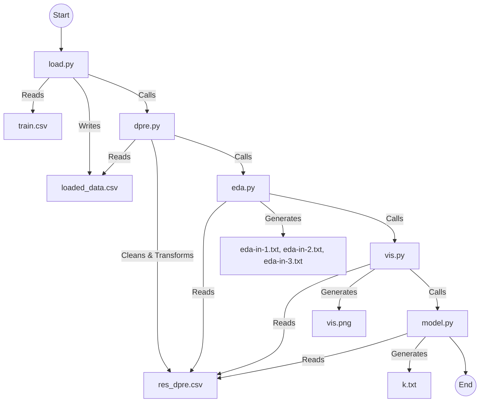

# Titanic Clustering Pipeline

## 📌 Project Overview
This project implements a data processing and clustering pipeline for the Titanic dataset. It automates the stages of loading, preprocessing, exploratory data analysis (EDA), visualization, and machine learning (K-Means clustering). The pipeline is designed to be modular, with each stage handled by a specific Python script that chains into the next.

The system is containerized using Docker to ensure a consistent environment for execution.

## 🏗 System Design
The pipeline operates sequentially. Each script performs its task, saves the output to a file, and triggers the next script in the chain using `subprocess`.



## 📂 Directory Structure
```
/
├── Dockerfile          # Configuration for the Docker environment
├── dpre.py             # Data preprocessing script
├── eda.py              # Exploratory Data Analysis script
├── final.sh            # Shell script to copy results from Docker container
├── load.py             # Data loading entry point
├── model.py            # K-Means clustering model script
├── test.ipynb          # Jupyter notebook for testing/experimentation
├── train.csv           # Input dataset
├── vis.py              # Visualization script
├── k.txt               # Output: Cluster counts (generated)
├── res_dpre.csv        # Output: Preprocessed data (generated)
├── service-result/     # Directory for collected results
└── README.md           # Project documentation
```

## 🛠 Technologies & Tools
*   **Language:** Python 3
*   **Libraries:**
    *   `pandas` (Data manipulation)
    *   `numpy` (Numerical operations)
    *   `scikit-learn` (Machine Learning: K-Means, Preprocessing)
    *   `seaborn` & `matplotlib` (Visualization)
    *   `scipy` (Scientific computing)
*   **Containerization:** Docker
*   **Scripting:** Bash

## 🚀 Getting Started

### Prerequisites
*   Python 3.x (for local run)
*   Docker (for containerized run)

### 📥 1. Clone the Repository
```bash
git clone https://github.com/Abdelrahman-Yasser-Zakaria/Titanic-Clustering-Docker.git
cd Titanic-Clustering-Docker
```

### 💻 2. Running Locally

1.  **Install Dependencies:**
    It is recommended to use a virtual environment.
    ```bash
    python3 -m venv venv
    source venv/bin/activate  # On Windows: venv\Scripts\activate
    pip install pandas numpy seaborn matplotlib scikit-learn scipy
    ```

2.  **Run the Pipeline:**
    Start the process by running the load script with your dataset.
    ```bash
    python3 load.py train.csv
    ```

3.  **Check Results:**
    Output files (`res_dpre.csv`, `eda-in-*.txt`, `vis.png`, `k.txt`) will be generated in the current directory.

### 🐳 3. Running with Docker

1.  **Build the Docker Image:**
    ```bash
    docker build -t titanic-pipeline .
    ```

2.  **Run the Container:**
    Since the Dockerfile copies `train.csv` but not the scripts, the best way to run this is by mounting your current directory to the container. This allows the container to see your scripts and for you to see the generated results immediately.
    ```bash
    docker run -it -v $(pwd):/home/doc-bd-a1/ titanic-pipeline /bin/bash
    ```

3.  **Execute the Pipeline inside the container:**
    ```bash
    # Inside the container
    python3 load.py train.csv
    exit
    ```

4.  **Extract Results (Alternative Method):**
    If you ran the container *without* mounting volumes (not recommended with current Dockerfile), the results are trapped inside. You can use `final.sh` to extract them, but you must update the container ID in the script first.
    1.  Get the container ID: `docker ps -a`
    2.  Update `final.sh` with the new ID.
    3.  Run: `bash final.sh`
